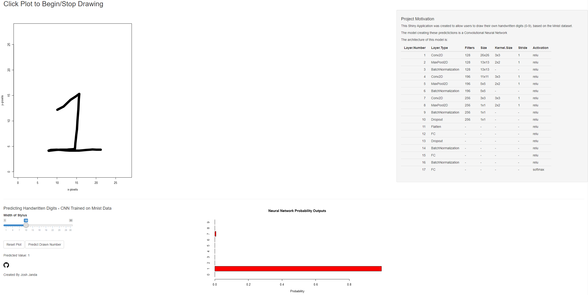

# Introduction

The goal of this project is to utilize data analytics and statistical modeling techniques to create accurate models for predicting handwritten digits provided by the MNIST dataset.

Included is a jupyter notebook in which does the analyzing and modeling.

Also included is a functioning Shiny app built in R to predict users own custom handwritten digits.

The Shiny App sources Python scripts for performing these predictions, and the predictions are made by a convolutional neural network in order to allow for shifted images versus an artificial neural net which doesn't perform as well when images are shifted.

Sample view of the app:

- Josh Janda